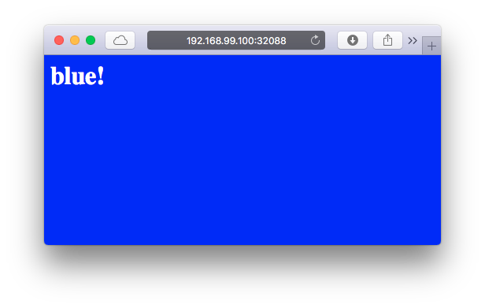

# bluegreen deployment by kubernetes sample

## create cluster

```
minikube start
```

## Build each version

```
eval $(minikube docker-env)
docker build -t blueenv   --build-arg dep=blue  .
docker build -t greenenv  --build-arg dep=green .
```

## run kube cluster

```
kubectl apply -f .
```

## check

```
minikube service the-service
# browser opens...
# caches may display old env.
```

```
$ ./check.sh
18:34:01 <h1>blue!<h1><style>body{background-color:blue;color:white;}</style>
18:34:02 <h1>blue!<h1><style>body{background-color:blue;color:white;}</style>
18:34:03 <h1>blue!<h1><style>body{background-color:blue;color:white;}</style>
18:34:04 <h1>blue!<h1><style>body{background-color:blue;color:white;}</style>
18:34:05 <h1>blue!<h1><style>body{background-color:blue;color:white;}</style>
18:34:06 <h1>blue!<h1><style>body{background-color:blue;color:white;}</style>
18:34:07 <h1>blue!<h1><style>body{background-color:blue;color:white;}</style>
18:34:08 <h1>blue!<h1><style>body{background-color:blue;color:white;}</style>
18:34:09 <h1>blue!<h1><style>body{background-color:blue;color:white;}</style>
18:34:10 <h1>green!<h1><style>body{background-color:green;color:white;}</style>
18:34:11 <h1>green!<h1><style>body{background-color:green;color:white;}</style>
18:34:12 <h1>green!<h1><style>body{background-color:green;color:white;}</style>
...
```

OK.




